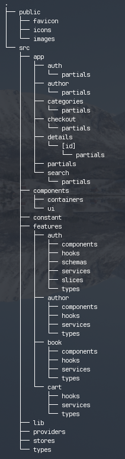

# library-booky

Book library web application - Booky

## Start app

`npm run dev`

## Folder Structure

- public: assets file
- src: application code
  - app: next routing
  - components: shared components
  - constant: typescript constants
  - features: feature related code in application. Each has its own related components, hooks, api services, types, and redux-slices.
  - lib: utilities
  - providers: provider components such as StoreProvider or QueryProvider
  - stores: redux store definition
  - types: common typescript types
- ...other configuration files
